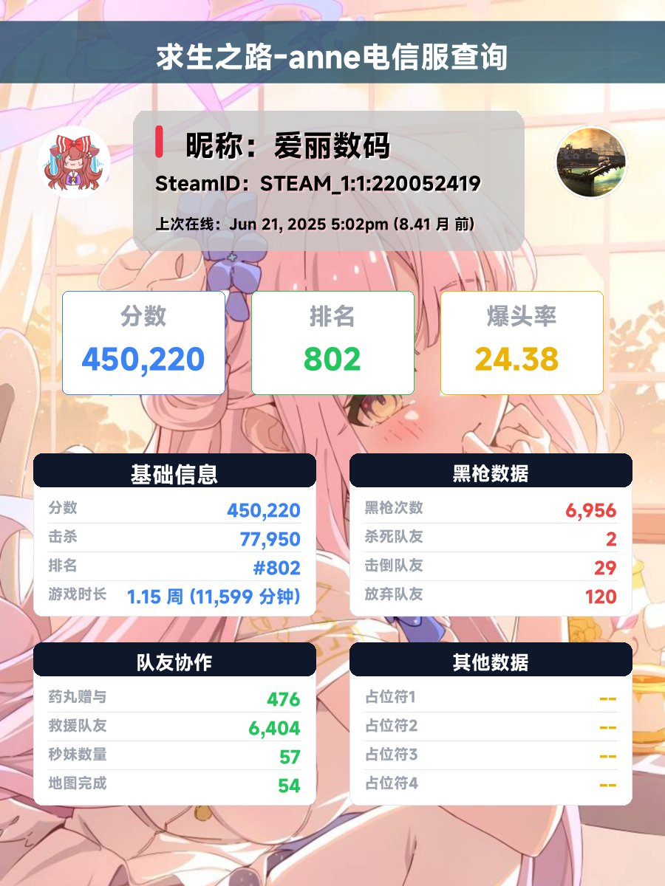

<!-- markdownlint-disable MD033 MD041 -->

<p align="center">
  <a href="https://github.com/Agnes4m/L4D2UID"></a>
</p>
<h1 align = "center">L4D2UID 0.1.0</h1>
<h4 align = "center">QQ群/频道、OneBot、微信、KOOK、Tg、飞书、DoDo、Discord 的 L4D2 数据查询插件</h4>
<div align = "center">
        <a href="http://docs.gsuid.gbots.work/#/" target="_blank">安装文档</a>
</div>

## 安装提醒

> 该插件为[早柚核心(gsuid_core)](https://github.com/Genshin-bots/gsuid_core)的扩展，支持 NoneBot2 & HoshinoBot & ZeroBot & YunzaiBot & Koishi。
>
> 要求 Python >= 3.12，使用 uv 管理依赖，ruff 格式化。

## 功能

### 基础服务

- `l4绑定 [steamid32]` - 绑定你的 Steam UID（求生之路内控制台输入 `status` 查看）
- `l4删除uid [steamid]` - 删除已绑定的 UID
- `l4切换uid [steamid]` - 切换绑定的 UID
- `l4切换 [电信/呆呆]` - 切换查询平台

### 电信 anne 服数据查询

- `l4查询 [SteamID]` - 查询电信 anne 服玩家数据（历史 + 赛季数据），返回暗色主题图片
- `l4搜索 [昵称]` - 按昵称搜索玩家

### 服务器状态

- `l4状态` - 查看 anne 电信服服务器状态（总玩家数、总击杀数、总爆头数、当前在线、今日在线、30天活跃），以及当前在线玩家列表图片

### 其他

- `l4帮助` - 呼出帮助界面

## 数据源

- **ANNESTATUSAPI** (`anne.trygek.com/stats/`) - 服务器状态与在线玩家
- **ANNEWEB_STEAM cookie** - 部分接口需要
- **呆呆API** (`stats.l4d2.cloud`) - 呆呆服数据

## 展示

</img>

## 安装

1. 发送 `core安装插件L4D2UID`
2. 发送 `core重启` 应用插件

或进入 plugins 目录手动 clone：

```bash
git clone --depth 1 https://github.com/Agnes4m/L4D2UID.git
```

## 协议

- [GPL-3.0 License](https://github.com/Agnes4m/L4D2UID/blob/master/LICENSE)
